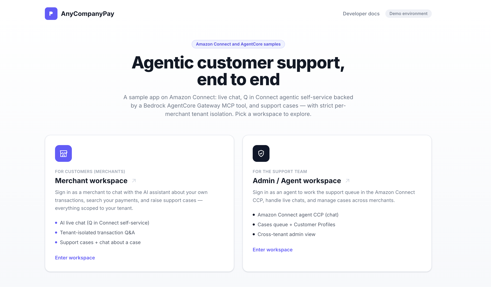
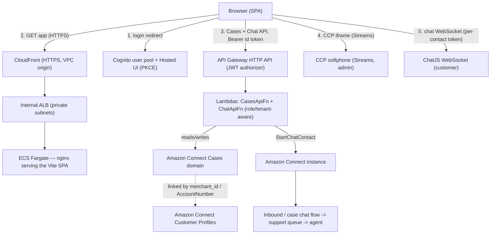
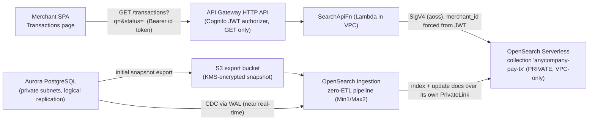

# Amazon Connect + Bedrock AgentCore samples

This is a **Amazon Connect + Amazon Bedrock AgentCore** sample built on a payments dashboard. It shows how to stand up an AWS application end to end, a containerized React SPA served privately through CloudFront, Cognito auth, an embedded Amazon Connect contact center, **Amazon Connect Cases**, live chat, and **agentic self-service** where a merchant asks about their own payments in chat and a **Q in Connect** orchestrator answers by calling a tenant-isolated **AgentCore Gateway** MCP tool, all with **multi-tenant merchants** whose tenant identity travels in the JWT and is enforced server-side.



> **Documentation index** — this README is the conceptual guide. Everything else
> lives in [`docs/`](docs/):
> [`DEPLOYMENT.md`](docs/DEPLOYMENT.md) (deploy/operate),
> [`connect-ai-agent/README.md`](connect-ai-agent/README.md) (the AI Q&A module).
> The app also ships a public developer-docs page at `/docs` (`src/pages/Docs.tsx`).

---

## Quick start

> Region and account come from your active AWS session. Region defaults to **`us-west-2`** when unset;
> override it with `AWS_REGION=<REGION>` (or `-c region=<REGION>` on any `cdk deploy`). Detailed guide: [`DEPLOYMENT.md`](docs/DEPLOYMENT.md).

### 1. Deploy

**Prereqs:** Node 20+, Docker running, aws authentication, and CDK bootstrapped in your target region. Execute below scripts in order, one after another.

```
# optional — omit to use the us-west-2 as default
export AWS_REGION=<REGION> 

aws ecr-public get-login-password --region us-east-1 \
  | docker login --username AWS --password-stdin public.ecr.aws

```
### App — web app, Cognito, SSM runtime config
```
cd infra && npm install
npx cdk deploy AnyCompanyPayAppStack --require-approval never

# Below script will create 5 merchants x 2 users
POOL=<UserPoolId> bash provision-merchants.sh
```
### Connect — instance, Cases, Customer Profiles, chat
```
npx cdk deploy AnyCompanyPayConnectStack --require-approval never
D=anycompany-pay-customer-profile bash provision-customer-profiles.sh
AGENT_EMAIL=agent1@anycompany-pay.example bash provision-agent.sh
```
### Database + private Search
```
cd ../database && npm install && npx cdk deploy AnyCompanyPayAuroraStack --require-approval never
cd ../opensearch-zeroetl && bash deploy.sh
```
### Agentic self-service — Gateway, tool + interceptor Lambdas, security profile
```
cd ../connect-ai-agent && npm install && bash deploy.sh
```

**Values to replace:** only `<REGION>` (optional) and `<UserPoolId>` — take the latter from the
`AnyCompanyPayAppStack` outputs (`aws cloudformation describe-stacks --stack-name AnyCompanyPayAppStack --query
"Stacks[0].Outputs"`). Everything else the scripts **discover automatically** from stack outputs
(account, VPC, subnets, collection endpoint, Connect instance ARN, gateway id) and pass on via `-c`.

### 2. One-time Connect setup (agentic self-service only)

Everything in step 1 must be deployed first — `AnyCompanyPayAppStack`, `AnyCompanyPayConnectStack`
(the Connect instance), the `database` / `opensearch-zeroetl` stacks the AI module reads, and
`AnyCompanyPayConnectAiAgentStack` (the Gateway). Then do the **two console steps** below, in order,
and only afterwards run the three scripts — each one depends on the console state before it.

**Signing in to the Connect admin console.** `AnyCompanyPayConnectStack` creates the instance's **admin** and
**agent** users with passwords **generated into AWS Secrets Manager**. The secret names are in the stack outputs `ConnectAdminSecretName`
/ `ConnectAgentSecretName` (default `anycompany-pay/connect/anycompany-pay-admin` and `anycompany-pay/connect/agent1`; with an env suffix, `anycompany-pay/<env>/connect/...`). Fetch the admin login — returns JSON `{"username","password"}`:

```
aws secretsmanager get-secret-value --region "$AWS_REGION" \
  --secret-id anycompany-pay/connect/anycompany-pay-admin --query SecretString --output text
```

The admin website is `https://<instance-alias>.my.connect.aws/`, where `<instance-alias>` defaults to
`anycompany-pay-<account-id>` (it is also the first label of the `CcpUrl` stack output).

#### Console step 1 — create the Q in Connect AI domain

The domain is the container the AI agent and its prompt live in, and it must be **associated with the
instance**. Create it from inside the instance so the association happens automatically:

1. Admin website → left nav **Q in Connect** (labelled **AI agents** on some instances) → **Domains** → **Add domain**.
2. **Create a new domain**, name it e.g. `anycompany-pay-ai-domain`.
3. **Encryption: use an AWS owned key.** A customer-managed key needs an explicit grant for the Q in
   Connect service role; without it the Lex build in `deploy-lex.sh` fails later.
4. No knowledge base or data integration is needed — the agent answers by calling the MCP tool, not from ingested content.

An instance can be associated with **one** domain at a time; adding a new one switches the instance off the old one.

#### Console step 2 — register the AgentCore Gateway as an MCP server

1. Admin website → **Third-party applications** → **Add integration**.
2. **Integration type** → **MCP server**.
3. **Integration details** → select the gateway `anycompany-pay-transaction-tools`.
4. **Instance association** → pick your instance, then **Add integration**.

The gateway is already configured for this by `AnyCompanyPayConnectAiAgentStack`: Connect (not Cognito)
is the token issuer, so the inbound **Discovery URL** is
`https://<instance-alias>.my.connect.aws/.well-known/openid-configuration` and the **allowed audience**
is the gateway id, which Connect puts in the token's `aud` claim.

> **If only "None" is selectable under Instance association,** the gateway's discovery URL doesn't match
> this instance. Redeploy the AI-agent module with the right alias — `bash deploy.sh` picks it up from the
> connect stack, or override with `-c connectAlias=<instance-alias>` / `-c connectDiscoveryUrl=<url>` — then reload the page.

#### Then run the three scripts

```
cd connect-ai-agent

# The security-profile MCP grant can only be created AFTER console step 2, so it is
# opt-in and skipped by the step-1 deploy. Create it now:
WITH_SECURITY_PROFILE=1 bash deploy.sh

# Orchestration prompt + AI agent + its 3 tools + assign the security profile +
# bind the agent as the instance's Self-Service orchestrator. This replaces what
# used to be four manual console steps in the AI Agent Designer.
bash provision-ai-agent.sh --apply --set-default

# Lex bot -> Q in Connect (discovers the assistant ARN + instance from outputs),
# then redeploys the connect stack with the Lex-alias + assistant context so the
# inbound chat flow (anycompany-pay-chat-inbound) switches to the agentic self-service path:
bash deploy-lex.sh
```

Re-run `provision-ai-agent.sh --apply --set-default` after any console publish of the agent (publishing
can reset the orchestrator binding). Each script also accepts explicit overrides, e.g. `ASSISTANT_ID=<id>`,
`GATEWAY_ID=<id>`, or `CONNECT_INSTANCE_ID=<id>`.

**Verify:** in the merchant app → **Support** → open live chat → ask *"how many failed transactions did
I have?"* You should get a tenant-correct answer, and the gateway + interceptor CloudWatch log groups
should show a `tools/call` with the injected `merchant_id`.

### 3. Clean up and tear down everything

```
# DRY-RUN — lists exactly what it would delete, changes nothing
./cleanup.sh           

# Actually delete
./cleanup.sh --apply    
```

Uses the same region/env resolution as deploy. Override with `REGION=<REGION>`, `ENV_NAME=<name>` (match what you deployed), or `DELETE_ECR=0` to keep the image repo. It removes **only** this sample's resources — matched by exact stack name and the `anycompany-pay` prefix

---

## 1. What it demonstrates

- **Private-by-default web hosting** — CloudFront → **VPC origin** → **internal** ALB → ECS Fargate.
  The load balancer is never exposed to the internet; only CloudFront can reach it.
- **Client-side Cognito auth** (OAuth2 Authorization Code + PKCE) with a public landing page and
  gated Admin / Merchant workspaces.
- **Two personas from one pool** — Cognito **groups** (`admin` / `merchant`) decide the *role*.
- **Multi-tenancy** — a Cognito **custom attribute** (`custom:merchant_id`) makes each merchant a
  tenant; the claim rides in the ID token and is the join key across the whole system.
- **Embedded contact center** — the Amazon Connect CCP (softphone) embedded via the Streams API.
- **Support via Amazon Connect Cases** — admins triage all cases; merchants raise and track **only
  their own** cases, isolated **server-side**.
- **Live chat (Amazon Connect Chat SDK)** — merchants chat with an agent two ways: a **floating chat
  widget** on every merchant page (a standalone live chat), and **from a support case** ("Chat about
  this case", whose transcript is written back to the ticket). Either way a `StartChatContact` Lambda
  stamps the tenant from the JWT, each merchant only accesses its own chat session (isolated
  **server-side**), and a basic flow routes it to a support queue.
- **Agentic self-service (Q in Connect + Bedrock AgentCore)** — in live chat a merchant can ask about
  **their own** transactions in natural language; Amazon Lex routes to a **Q in Connect** orchestrator
  that calls the `query_transactions` **MCP tool** through an **AgentCore Gateway**. A request
  interceptor injects the trusted `merchant_id` from the Connect contact so the tool only ever returns
  the caller's rows — the tenant is **never** supplied by the model. The gateway, its tool target, and
  the interceptor are native `AWS::BedrockAgentCore::*` CDK resources.
- **Customer Profiles (B2B model)** — merchants and their users mirrored into Amazon Connect Customer
  Profiles as account + individual profiles.
- **Infrastructure as code, modular** — two independently-deployable AWS CDK stacks (app + Connect)
  with runtime config decoupled through an SSM parameter, so the web app can ship without Connect and
  the Connect module can be added later without touching the app.

---

## 2. Architecture at a glance



**The request paths:**

1. **Login** — the SPA redirects to the Cognito Hosted UI (Authorization Code + PKCE). Cognito
   returns a code to `/auth/callback`; the SPA exchanges it for tokens and stores them in
   `localStorage`.
2. **App delivery** — the browser loads the SPA over HTTPS from CloudFront, which pulls from the
   **internal** ALB through a VPC origin. nginx (in Fargate) serves the static build and answers
   `/healthz`.
3. **Support/Cases** — the SPA calls the API Gateway HTTP API with the Cognito **ID token** as a
   bearer. The JWT authorizer validates it; the Lambda authorizes by role/tenant and calls
   `connectcases`.
4. **Contact center (agent side)** — the Admin workspace embeds the Connect CCP via the Streams API
   (a separate Connect agent login — see §9).
5. **Live chat (customer side)** — from a case, the SPA calls `POST /chat/start` (same API/authorizer)
   with the `caseId`; `ChatApiFn` runs `StartChatContact` (stamping tenant + the server-verified
   `case_id` from the JWT) and returns a per-contact token. ChatJS opens a WebSocket directly to the
   Connect participant service; the flow routes the contact to the support queue where the agent
   (path 4) answers.

For the full Amazon Connect picture — instance, CCP, Cases, Customer Profiles, chat flows, queue,
routing profile, and how the tenant threads through all of it — see [§6a](#6a-how-amazon-connect-fits-together).

---

## 3. Components and why they exist

| Component | What it is | Why |
|---|---|---|
| **CloudFront** | CDN + TLS front door; `redirect-to-https`; origin is a **VPC origin** to the internal ALB | Public entry without exposing the ALB; terminates HTTPS at the edge |
| **VPC + internal ALB** | 2 AZs, public/private subnets, 1 NAT; ALB `internetFacing:false` in private subnets | Compute stays private; ALB only reachable via CloudFront's origin-facing prefix list |
| **ECS Fargate (nginx)** | Runs the containerized SPA; CPU autoscaling (1–4 tasks) | Serverless containers; no EC2 to manage |
| **Cognito user pool + Hosted UI** | Auth, `admin`/`merchant` groups, `custom:merchant_id`/`merchant_name` | Managed identity; groups = role, custom attr = tenant, both in the JWT |
| **Amazon Connect instance** | Contact center; CCP embedded in the Admin dashboard | Live agent softphone in-app |
| **Cases API (API Gateway + Lambda)** | HTTP API + Cognito JWT authorizer → `CasesApiFn` → `connectcases` | Browsers can't SigV4-sign `connectcases` and it has no CORS; the Lambda is the minimal secure backend and enforces role/tenant |
| **Chat API (`ChatApiFn`)** | Same HTTP API + authorizer; `POST /chat/start` → `StartChatContact` | Server-side chat origination so the tenant is stamped from the JWT (never the client) and the browser only gets a per-contact token |
| **Amazon Connect Cases domain** | Support cases with custom fields (`summary`, `priority`, `case_status`, `merchant`, `merchant_id`) | Real ticketing, tenant-tagged |
| **Chat flows + support queue + routing profile + agent** | Inbound chat flow, a separate case chat flow, a `CHAT`-enabled routing profile, and an agent user | The routing path that gets a merchant's chat to a human; all created in CDK (agent via `provision-agent.sh` so no password is in the template) |
| **Customer Profiles domain** | B2B account + individual profiles per merchant/user | Agents can look up who is contacting and their merchant |
| **Aurora PostgreSQL** (`database/`) | Latest Aurora PG (18.4), `db.t4g.large`, isolated private subnets, logical replication on; a Lambda seeds 200 multi-tenant transactions | The system of record for transactions; source for zero-ETL. Private (no IGW/NAT); seeded in-VPC so the DB is never exposed |
| **OpenSearch Serverless collection** (`opensearch-zeroetl/`) | `SEARCH` collection `anycompany-pay-tx`, **VPC-only** (`AllowFromPublic:false`), reached via VPC endpoints | Fast search/filter over transactions without exposing the collection publicly |
| **OpenSearch Ingestion (zero-ETL) pipeline** | `rds` source → serverless sink, Min1/Max2, attached to the Aurora VPC | Initial snapshot (Aurora→S3→index) + near-real-time CDC (WAL) with no custom ETL to maintain |
| **Search API (`SearchApiFn`)** | HTTP API + Cognito JWT authorizer → Lambda **in the Aurora VPC** → the private collection; `GET /transactions`, `GET /transactions/{id}` | GET-only search; enforces tenant isolation by forcing `merchant_id` from the validated JWT |
| **SSM runtime-config parameter** | `/anycompany-pay/<env>/runtime-config` (Cognito + Connect + `searchApiUrl` values) | Decouples the stacks: the app reads it as a secret; the Connect and zero-ETL stacks merge their values in and force an ECS redeploy — no rebuild, no circular dependency |

---

## 4. Identity & access model

Authentication and authorization are deliberately layered:

- **One Cognito user pool**, public SPA app client (no secret), Authorization Code + **PKCE**.
- **Role** = Cognito group: `admin` (operations/agents) or `merchant`. The SPA reads `cognito:groups`
  to decide which workspace a user may enter; a user of one persona cannot enter the other.
- **Tenant** = custom attributes on the pool, emitted in the **ID token**:
  - `custom:merchant_id` — stable tenant key (e.g. `mch_luxe`)
  - `custom:merchant_name` — display name (e.g. `Luxe Living`)
- **The join key.** `merchant_id` ties the whole system together:

  ```
  Cognito custom:merchant_id  (JWT claim)
        │
        ├──► Cases `merchant_id` field   (tenant tag on each case)
        │
        └──► Customer Profiles AccountNumber  (groups a merchant's account + users)
  ```

Client-side code uses claims only for **UX** (which workspace, tenant badge). Every real
authorization decision is made **server-side** — the API Gateway JWT authorizer plus the Lambda.

---

## 5. Multi-tenancy & server-side isolation

Merchants are multi-tenant: many users per merchant, and a merchant must never see another's data.

- **5 merchants × 2 users** are provisioned in Cognito (`infra/provision-merchants.sh`), each in the
  `merchant` group and tagged with their `custom:merchant_id` / `custom:merchant_name`.
- The Cases Lambda enforces isolation off the **validated JWT claim** (never a client value):
  - **List** — a merchant sees only cases whose `merchant_id` equals their claim.
  - **Create** — `merchant_id` is **forced** from the claim; the form doesn't collect it.
  - **Read / comment / update** — the Lambda checks the case's `merchant_id` first and returns
    **403** on cross-tenant access.
- **Admins** skip the tenant filter and see all merchants' cases.

This was verified end to end: two merchants each see only their own case; a cross-tenant `GET` and
`comment` both return `403`; a merchant is blocked from the admin workspace.

---

## 5a. Merchant transaction search (Aurora → zero-ETL → OpenSearch)

Merchants can search and check the status/details of **their own** transactions on the
**Transactions** page (`/merchant/transactions`). Search is served from a **private Amazon OpenSearch
Serverless** collection, kept in sync from Aurora PostgreSQL by an AWS-managed **zero-ETL**
(OpenSearch Ingestion) pipeline. Two self-contained modules provide it: `database/` (Aurora) and
`opensearch-zeroetl/` (collection + pipeline + Search API).



**How it works**

- **Data pipeline** — `opensearch-zeroetl` runs an OpenSearch Ingestion pipeline whose `rds` source
  does a full initial snapshot (Aurora → S3 → index) and then streams changes via logical replication
  (WAL) into the collection. Change a row in Aurora and the OpenSearch document updates in near real
  time (that's how the status re-seed propagated).
- **Private throughout** — the collection has **no public access** (`AllowFromPublic: false`); it's
  reached only through VPC endpoints. The pipeline writes over an OpenSearch-managed PrivateLink
  endpoint; the Search Lambda queries over the collection's VPC endpoint. Aurora sits in isolated
  private subnets.
- **GET-only Search API** — API Gateway (HTTP API) with a Cognito JWT authorizer fronts `SearchApiFn`
  (a Lambda **inside the Aurora VPC**). Routes: `GET /transactions` (list/search + `status`/`q`
  filters) and `GET /transactions/{id}`.
- **Server-side isolation (Pool model)** — one shared index keyed by `merchant_id`; the Lambda forces
  the tenant filter from the **validated JWT claim** (`custom:merchant_id`), so a merchant can only
  ever search their own transactions. Admins may search across tenants (optionally narrowed by
  `?merchant_id=`). Filtering/search runs in OpenSearch (`term` on `status.keyword`, `multi_match`
  phrase-prefix on `q`), not in the browser. This is the **Pool** pattern (shared index + app-layer
  tenant filtering) from AWS's [multi-tenant OpenSearch guidance](https://aws.amazon.com/blogs/apn/storing-multi-tenant-saas-data-with-amazon-opensearch-service/);
  see [`DEPLOYMENT.md`](docs/DEPLOYMENT.md) §17 for the pattern choice and trade-offs.
- **Seed data** — `database/` seeds 200 multi-tenant transactions across 5 merchants with a realistic
  status spread (`succeeded`, `pending`, `in_progress`, `failed`, `refunded`, `authorized`).

Verified end to end: `documentsSuccess=200` in the collection; unauthenticated `GET → 401`; a Luxe
token returns only `mch_luxe` rows and a Nova token only `mch_nova`; the status filter returns the
expected per-status counts.

---

## 6. Support: Amazon Connect Cases

- **Admin** (`/admin/cases`) — full queue across all merchants: list, create, set status, comment.
- **Merchant** (`/merchant/support`) — raise and track **only their own** cases; create + comment
  (status is owned by the support team).
- **Backend** — API Gateway HTTP API guarded by an `HttpJwtAuthorizer` (issuer = user pool,
  audience = SPA client id) in front of `CasesApiFn`. **No open Function URL** — the Lambda is
  invocable only by the API (resource policy scoped to `apigateway.amazonaws.com` + this API's ARN),
  and its execution role is scoped to the Cases domain.

### Live chat (Amazon Connect Chat SDK)

Merchants can start a **live chat** with a support agent two ways, both built on the **Amazon Connect
Chat SDK (ChatJS)** (a custom chat UI in the app, not the hosted widget):

- a **floating chat widget** (a bottom-right bubble) on every merchant page — a standalone live chat
  that stays alive while minimized and across merchant-page navigation; and
- **from a support case** on `/merchant/support` (the "Chat about this case" button), which binds the
  chat to that case and writes the transcript back to it when the chat ends.

Both share one hook (`src/connect/useConnectChat.ts`) and the same secure backend:

- **Same secure backend shape as Cases.** A `POST /chat/start` route on the *same* HTTP API + JWT
  authorizer invokes `ChatApiFn`, which calls `StartChatContact` and returns the per-contact
  `{ contactId, participantId, participantToken }`. ChatJS then opens a WebSocket as the customer
  participant.
- **Server-enforced isolation.** The Lambda stamps `merchant_id` / `merchant_name` / `email` as
  **contact attributes from the validated JWT** — a client value is ignored, so a merchant can't chat
  as another tenant. The `ParticipantToken` is scoped to that one contact, so a merchant only ever
  accesses its own chat session.
- **Basic contact flow, all IaC.** The CDK connect stack creates hours of operation, a support queue,
  a `CHAT`-enabled routing profile, and an inbound chat flow (greet → set queue → transfer). An agent
  on that routing profile answers from the embedded CCP (Admin → Contact Center). See
  [`DEPLOYMENT.md` §15](docs/DEPLOYMENT.md#15-live-chat-amazon-connect-chat-sdk).
- **Bound to the case (history saved to the ticket).** The chat uses a dedicated case chat flow and
  binds to the case only after the server verifies it belongs to the caller's tenant. When the chat
  ends, the transcript is written back to the case as a comment — so the conversation lives in the
  ticket.

The live-chat widget uses a custom ChatJS UI (rather than the hosted communications widget); see
§15 of [`DEPLOYMENT.md`](docs/DEPLOYMENT.md) for how it's wired.

---

## 6a. How Amazon Connect fits together

Amazon Connect shows up in four places in this app; they share **one instance** and are tied together
by the tenant key `merchant_id`.

| Capability | Library / API | Where it lives | Who authenticates |
|---|---|---|---|
| **Agent softphone (CCP)** | `amazon-connect-streams` | Admin → Contact Center (iframe) | Connect agent login (separate) |
| **Ticketing (Cases)** | `@aws-sdk/client-connectcases` via `CasesApiFn` | Admin Cases + Merchant Support | Cognito (reused) |
| **Live chat** | `amazon-connect-chatjs` + `StartChatContact` via `ChatApiFn` | Merchant Support | Cognito (reused) |
| **Customer Profiles** | `@aws-sdk/client-customer-profiles` | Agent workspace lookups | — (data plane) |

**Two sides of a chat, two SDKs, one global.** The **customer** side (merchant dashboard) uses
**ChatJS**; the **agent** side (admin CCP) uses **Streams**. Both libraries attach to the same
`window.connect` global, so loading both on one page breaks chat with a *"There is no upstream
conduit!"* error. The app keeps them apart: Streams is imported only by the admin Contact Center page,
which is **lazy-loaded** (its own JS chunk), and ChatJS is **dynamically imported** only inside the
merchant chat component. Neither ever loads on the other's page.

**The chat routing path** (what happens after a merchant clicks *Start chat*):

```
ChatApiFn: StartChatContact(InstanceId, ContactFlowId, Attributes{merchant_id,…}, SegmentAttributes=AUTHENTICATED)
      │  returns { ContactId, ParticipantId, ParticipantToken }   ← per-contact, scoped
      ▼
Contact flow (anycompany-pay-chat-inbound OR anycompany-pay-chat-case)
      MessageParticipant (greeting) → UpdateContactTargetQueue(support queue) → TransferContactToQueue
      ▼
Support queue ──(routing profile with the CHAT channel enabled)──▶ Agent (agent1) in the CCP
```

Everything except the agent user is created in CDK (`connect-stack.ts`): the instance, the approved
origin for the CCP iframe, the Cases domain + fields + template, the Cases-domain→instance
association, the Customer Profiles domain + KMS key, the hours of operation, the support queue, the
`CHAT` routing profile, and both chat flows. The **agent user is created out-of-band**
(`provision-agent.sh`) so no password lands in the CloudFormation template.

### How multi-tenancy threads through Connect

The same `merchant_id` that isolates Cases also isolates chat — and it is always taken from the
**validated JWT**, never from the client:

- **Contact attributes are stamped server-side.** `ChatApiFn` reads `custom:merchant_id`,
  `custom:merchant_name`, `email` (and, for case chats, a server-verified `case_id`) from the token
  and attaches them to the contact. A merchant literally cannot open a chat as another tenant.
- **Per-contact token scoping.** `StartChatContact` returns a `ParticipantToken` bound to that one
  contact; the browser can only ever join its own chat. Cross-tenant chat access is impossible by
  construction, not by a UI check.
- **Pre-chat authentication.** Because the caller already proved identity via Cognito, the contact is
  flagged `connect:CustomerAuthentication = AUTHENTICATED` with `CustomerId = merchant_id`, so the
  agent sees a verified, tenant-tagged customer.
- **Case binding is verified.** Starting a chat *from a case* passes a `caseId`; the Lambda calls
  `cases:GetCase` and only proceeds if the case's `merchant_id` matches the caller's tenant (else
  403 / 404). The transcript is later written back to that case via the same tenant-isolated comments
  endpoint.

So a single claim — `custom:merchant_id` in the Cognito ID token — is the tenant boundary across
Cases (a field on every case), chat (a contact attribute + the case-ownership check), and Customer
Profiles (the `AccountNumber` join key), and it is enforced in the Lambdas, never in the browser.

---

## 7. Customer Profiles (B2B account model)

Merchants are mirrored into Amazon Connect Customer Profiles (`infra/provision-customer-profiles.sh`)
following AWS's B2B pattern:

- **Account profile per merchant** (`ProfileType=ACCOUNT_PROFILE`, `BusinessName`, `AccountNumber = merchant_id`).
- **Individual profile per user** (`ProfileType=PROFILE`, `EmailAddress`, `AccountNumber = merchant_id`).

Agents can search by person (`_email`) or account (`_account = merchant_id`) and see everyone under a
merchant. See [`DEPLOYMENT.md`](docs/DEPLOYMENT.md) §14 for details.

---

## 8. Security practices

The practices this project deliberately follows (and why):

- **No public load balancer.** The ALB is internal; its security group only admits CloudFront's
  `com.amazonaws.global.cloudfront.origin-facing` managed prefix list. Compute runs in private
  subnets with `assignPublicIp:false`. No `0.0.0.0/0` ingress anywhere in the VPC.
- **HTTPS everywhere at the edge** — CloudFront `redirect-to-https`.
- **No open Lambda.** The Cases Lambda has **no Function URL**; its resource policy names
  `apigateway.amazonaws.com` with a `SourceArn` condition (an earlier open Function URL was removed
  after an AppSec finding).
- **Two-layer authz.** API Gateway rejects any request without a valid Cognito token (401); the
  Lambda then authorizes by role and tenant (403 otherwise). The browser is never the enforcement
  point.
- **Least-privilege IAM.** The Lambda role is scoped to specific `cases:*` actions on the Cases
  domain ARN, not `*`.
- **Correct token choice.** The SPA sends the **ID token** (its `aud` = the app client id, which the
  JWT authorizer requires); custom attributes ride in the ID token.
- **Secrets hygiene.** No secrets in the stack; the Cognito client has no secret (PKCE). Demo
  passwords are generated by Secrets Manager at deploy/provision time and read back from there — no
  password literal exists anywhere in this repository.
- **Runtime config, not build-time.** Cognito/Connect settings live in an SSM parameter, injected as
  the `RUNTIME_CONFIG` ECS secret and written to `/auth-config.json` at container start, so the same
  image runs in any environment and the two stacks stay decoupled.
- **Chat originated server-side.** The browser never calls `StartChatContact` directly (it has no AWS
  credentials and the API has no CORS); `ChatApiFn` does, stamping the tenant from the JWT and
  returning only a per-contact `ParticipantToken`.
- **Content Security Policy + XSS-safe rendering.** nginx sends a CSP scoped to Cognito, the API, and
  the Connect participant `wss`/CCP origins (per AWS's chat security guidance); chat messages are
  rendered as React text nodes (never `innerHTML`).
- **ChatJS/Streams isolation.** The customer chat (ChatJS) and agent CCP (Streams) libraries are kept
  off each other's pages via lazy/dynamic imports, avoiding the shared-`window.connect` conflict.
- **No secrets in the template.** The Connect agent user is created by a script, not CloudFormation,
  so no agent password is ever stored in the stack.

- **Data at rest encrypted.** Aurora storage, the S3 export bucket (SSE-S3 + `BlockAll` +
  `enforceSSL`), and every Secrets Manager secret are encrypted; the Aurora cluster sits in
  `PRIVATE_ISOLATED` subnets with no internet gateway or NAT route.

### Static analysis and accepted deviations

Every synthesized template plus the standalone CloudFormation template are scanned with
[Checkov](https://www.checkov.io/). The remaining findings are **demo-scope trade-offs**, not
defects — each is a hardening step you would add for production, listed here so nothing is silent:

| Finding | Why it's accepted here | For production |
|---|---|---|
| Secrets/log groups use AWS-managed keys (`CKV_AWS_149`, `CKV_AWS_158`) | Encrypted at rest; a CMK adds key administration to a demo | Supply a customer-managed KMS key |
| No access logs on ALB / CloudFront / API Gateway / S3 (`CKV_AWS_91`, `86`, `95`, `18`) | Avoids provisioning log buckets and their lifecycle for a teardown-in-a-day sample | Enable access logging with a retention policy |
| No WAF on CloudFront (`CKV_AWS_68`) | Per-month cost with no demo value | Attach a WAF web ACL |
| Lambdas not in a VPC, no DLQ, no reserved concurrency (`CKV_AWS_117`, `116`, `115`) | These call AWS control-plane APIs only, and most are CDK-generated custom-resource handlers | Add DLQs and concurrency caps for anything customer-facing |
| ALB listener is HTTP, not HTTPS (`CKV_AWS_2`, `CKV_AWS_103`) | The ALB is **internal** and only reachable from CloudFront over a VPC origin; TLS terminates at the edge | Terminate TLS on the ALB too if the VPC is untrusted |
| CloudFront viewer cert is the default (`CKV_AWS_174`) | No custom domain, so the minimum TLS version isn't settable | Bring a custom domain + ACM certificate |
| Aurora has no IAM auth or enhanced monitoring (`CKV_AWS_162`, `CKV_AWS_118`) | Access is via the generated Secrets Manager credential from inside the VPC only | Enable IAM database authentication and Performance Insights |
| The OSIS pipeline role allows unconstrained write on one service (`CKV_AWS_111`) | Its actions are account-scoped and accept no resource-level ARN; the statement carries an inline justification | Narrow as service support lands |

Also documented but not enabled: SSO for the CCP softphone (would require recreating the Connect
instance as SAML); self-hosting the web font to drop the Google Fonts CSP allowance; the native Cases
`CreateRelatedItem` (`Contact`) link for the agent-workspace chat-transcript view.

---

## 9. Known limitations / out of scope

- **CCP second login.** The embedded Connect softphone (`/admin/contact-center`) uses Connect's own
  identity, so it prompts a separate agent login. True SSO needs SAML federation (instance
  recreation) — parked by design.
- **Some merchant dashboard pages are mock.** **Cases**, **transaction search** (§5a), and the
  **commerce APIs** — refunds/disputes/`POST /transactions` — are real and tenant-isolated;
  the commerce resources have no UI yet (backend only). Any remaining sample pages would move onto the
  same tenant-scoped APIs to extend isolation across the board.
- **Amazon Bedrock AgentCore** agentic self-service **is implemented** (Q in Connect orchestrator →
  AgentCore Gateway MCP tool → tenant-isolated OpenSearch), provisioned by `AnyCompanyPayConnectAiAgentStack`
  as native `AWS::BedrockAgentCore::*` resources, with the console wiring documented in [§2 of the quick
  start](#2-one-time-connect-setup-agentic-self-service-only). Deeper hardening (AgentCore Identity
  for signed per-merchant tokens, AgentCore Policy) is documented as additive upgrades in
  [`connect-ai-agent/README.md`](connect-ai-agent/README.md).

---

## 10. Repository layout

```
.
├── src/                         # React + Vite SPA
│   ├── auth/                    # Cognito PKCE auth (AuthProvider, tokens, pkce, authConfig)
│   ├── connect/                 # Runtime config, Cases/Chat/Search API clients, useConnectChat hook, transactionsApi
│   ├── components/              # layout (Sidebar/Topbar/nav), chat/ (FloatingChat + ChatConversation), ui primitives
│   ├── pages/
│   │   ├── PersonaSelect.tsx    # landing page (role picker)
│   │   ├── AuthCallback.tsx     # Cognito PKCE callback handler
│   │   ├── Docs.tsx             # public developer-docs page (/docs)
│   │   ├── admin/               # CaseManagement, ContactCenter (lazy)
│   │   └── merchant/            # Transactions (OpenSearch), Support, SupportChat
│   ├── data/                    # shared types
│   └── App.tsx                  # routes (admin/* and merchant/* under RequireAuth)
├── database/                    # Aurora PostgreSQL module (own CDK app: AnyCompanyPayAuroraStack)
│   ├── lib/aurora-stack.ts      # VPC (isolated subnets), Aurora PG 18.4, logical replication, seed trigger
│   └── lambda/seed/             # in-VPC seeder: creates transactions table + 200 multi-tenant rows
├── opensearch-zeroetl/          # Zero-ETL + search module (own CDK app: AnyCompanyPayZeroEtlStack)
│   ├── lib/zeroetl-stack.ts     # private OpenSearch Serverless collection, OSIS pipeline, Search API, SSM config merge
│   └── lambda/
│       ├── search-api/          # SearchApiFn: GET-only, JWT-derived tenant filter -> private collection
│       ├── commerce-api/        # CommerceApiFn: POST /transactions, refunds + disputes, dispute->Connect Case
│       └── config-writer/       # merges searchApiUrl + commerceApiUrl into the SSM runtime config + ECS redeploy
├── connect-ai-agent/            # AI transaction Q&A module (own CDK app: AnyCompanyPayConnectAiAgentStack)
│   ├── lib/
│   │   ├── connect-ai-agent-stack.ts  # AgentCore Gateway + target + interceptor (AWS::BedrockAgentCore::*)
│   │   │                              #   + tool/interceptor Lambdas + gateway exec role
│   │   ├── lex-stack.ts               # Lex bot + alias for Q in Connect routing
│   │   └── qic-domain-stack.ts        # Q in Connect domain (CDK-managed alternative to console step 1)
│   ├── lambda/
│   │   ├── transaction-tool/    # MCP tool: tenant-filtered OpenSearch query (read-only)
│   │   ├── gateway-interceptor/ # AgentCore Gateway request interceptor (tenant gate, fail-closed)
│   │   └── gateway-audience/    # custom resource: sets allowedAudience=[gatewayId] (self-reference)
│   ├── deploy.sh                # deploy the AI-agent CDK stack
│   ├── deploy-lex.sh            # Lex bot -> Q in Connect; redeploys connect stack with Lex context
│   ├── deploy-qic-domain.sh     # deploy Q in Connect domain stack
│   ├── provision-ai-agent.sh    # create Q in Connect orchestration prompt + agent; bind Self-Service
│   └── provision-gateway.sh     # DEPRECATED — gateway is CDK now; legacy CLI path, guarded off
├── infra/
│   ├── lib/
│   │   ├── app-stack.ts         # Module 1: VPC, ALB, CloudFront, ECS+SPA, Cognito, SSM config
│   │   └── connect-stack.ts     # Module 2: Connect instance, Cases, Customer Profiles, chat flows/queue/routing profile
│   ├── bin/app.ts               # instantiates the app + Connect stacks
│   ├── cloudformation/          # standalone CFN template (anycompany-pay.yaml) + build-and-push helper
│   ├── lambda/
│   │   ├── cases-api/           # Cases API Lambda (role/tenant-aware)
│   │   ├── chat-api/            # StartChatContact Lambda (tenant-stamped; case binding)
│   │   ├── connect-user/        # Connect user provisioning Lambda
│   │   └── config-writer/       # custom resource: merges Connect values into the SSM param + ECS redeploy
│   ├── provision-merchants.sh          # merchant tenants + users in Cognito
│   ├── provision-customer-profiles.sh  # Customer Profiles (B2B) for merchants
│   ├── provision-agent.sh              # Connect agent user (answers chats) — no password in CFN
│   └── provision-phone-number.sh       # claim an inbound voice number + associate a voice flow (idempotent)
├── Dockerfile                   # multi-stage: node build -> nginx serve
├── nginx.conf                   # SPA fallback, /healthz, asset caching
├── 40-auth-config.sh            # container entrypoint: writes /auth-config.json from env
├── cleanup.sh                   # full teardown (dry-run by default; --apply to delete)
└── docs/                        # all documentation, diagrams, and console screenshots
    ├── DEPLOYMENT.md            # detailed deploy/operate guide
    └── *.drawio                 # architecture diagrams
```

---

## 11. Tech stack

- **Frontend:** React 18, Vite 5, React Router 6, TypeScript, Tailwind CSS, Recharts,
  `amazon-connect-streams` (agent CCP), `amazon-connect-chatjs` (customer chat).
- **Infra:** AWS CDK (`aws-cdk-lib` 2.267, TypeScript); Node 22 Lambdas using
  `@aws-sdk/client-connectcases` and `@aws-sdk/client-connect`.
- **Data & search:** Aurora PostgreSQL 18.4 (`pg` in the seed Lambda), Amazon OpenSearch Serverless
  (private collection), Amazon OpenSearch Ingestion (zero-ETL `rds` source), and
  `@opensearch-project/opensearch` with `AwsSigv4Signer` (service `aoss`) in the Search Lambda.
- **Runtime:** nginx (Alpine) in ECS Fargate; base images from `public.ecr.aws`.

### Why these choices

- **CDK (TypeScript), not raw CloudFormation** — the same language as the app, real loops/typing, and
  L2 constructs for the VPC/ALB/ECS/Cognito wiring. Amazon Connect resources use L1 (`Cfn*`)
  constructs since there are no L2s yet.
- **Two stacks + SSM runtime config, not one stack** — lets the web app deploy and run with **zero
  Connect dependency**, and the Connect module be added later. The app owns the SSM parameter; the
  Connect stack merges its values in and forces an ECS redeploy. This avoids a circular dependency
  and a shared blast radius. (See `DEPLOYMENT.md` §6b.)
- **ECS Fargate + CloudFront VPC origin, not S3/static hosting** — keeps compute and the load
  balancer **private** (no public bucket, no public ALB) while still serving a static SPA, and models
  a realistic private-compute topology.
- **Cognito Hosted UI + PKCE (public client)** — standard SPA auth with no client secret; groups give
  role and a custom attribute gives tenant, both in the ID token, so authorization needs no extra
  lookup.
- **A thin Lambda in front of `connectcases`/`connect`, not direct browser calls** — browsers can't
  SigV4-sign those APIs and they have no CORS; more importantly, a server-side boundary is the only
  safe place to enforce tenant isolation and stamp identity from the validated JWT.
- **ChatJS (custom UI), not the hosted communications widget** — the requirement was chat embedded
  *inside* the merchant dashboard with full UI control; the trade-off is more code, handled by the
  `StartChatContact` proxy + a small React component.
- **Amazon Connect Cases as the ticket store, not a home-grown table** — real ticketing with custom
  fields, a template, related items (comments), and the same records visible in the agent workspace.

---

## 12. Local development

```
npm install
npm run dev          # Vite dev server at http://localhost:5173
npm run build        # tsc -b && vite build  (also the typecheck/lint gate)
```

For auth/Connect features locally, provide `VITE_CONNECT_CCP_URL` / `VITE_CONNECT_REGION` (see
`src/connect/config.ts`); otherwise those features degrade gracefully. `localhost:5173` is already a
registered Cognito callback/logout URL.

---

## 13. Related docs

All guides live under [`docs/`](docs/):

- [`docs/DEPLOYMENT.md`](docs/DEPLOYMENT.md) — components, design decisions, users/groups,
  multi-tenancy, Cases, Customer Profiles, CCP, teardown, and verification commands.
- [§2. One-time Connect setup](#2-one-time-connect-setup-agentic-self-service-only) — console steps
  for agentic self-service: create the Q in Connect AI domain and register the MCP server.
- [`connect-ai-agent/README.md`](connect-ai-agent/README.md) — the AI transaction Q&A module
  (Connect AI Agent Designer → AgentCore Gateway MCP → tenant-isolated OpenSearch tool): design,
  trust chain, the AgentCore component decisions, and the CDK-managed gateway.
- [`cleanup.sh`](cleanup.sh) — full, scoped teardown of everything this sample provisions
  (dry-run by default).
- Developer-docs page — a public `/docs` route in the app (`src/pages/Docs.tsx`) with the solution
  architecture, agentic self-service, Amazon Connect, and tenant-isolation deep-dives and diagrams.

---

## License

MIT-0. See the repository [LICENSE](../../LICENSE).

---

*Demo/reference project. Rotate or remove demo credentials before any real use.*
